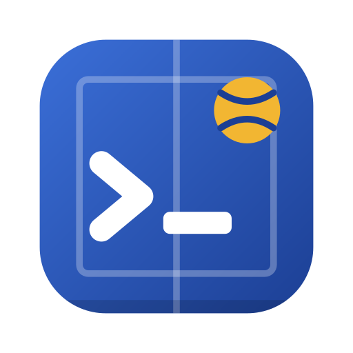

<p align="center">
  
</p>

<h1 align="center">teambath</h1>

<p align="center"><b>Find a free court at Team Bath without clicking through the booking site.</b></p>

Want a squash court this week? On [bookings.teambath.com](https://bookings.teambath.com/Connect/memberHomePage.aspx) that means log in, search, open the activity, and check the grid, one day at a time. Then do it all again for badminton. The free student slots only open 5 days ahead, so you end up doing this a lot.

teambath does that clicking for you, from Python:

```python
from datetime import date, timedelta
from teambath import TeamBath

tb = TeamBath("abc123@bath.ac.uk", "1234")          # the email and PIN you log in with

for day in range(6):                                # today + the 5 days you can book
    d = date.today() + timedelta(days=day)
    free = [s for s in tb.availability("SQUASHFREE2", d) if s.available]
    print(f"{d:%a %d %b}: {len(free)} free", *sorted({f"{s.start:%H:%M}" for s in free})[:4])
# Wed 30 Sep: 0 free
# Thu 01 Oct: 51 free 07:00 07:45 08:30 09:15
# Fri 02 Oct: 42 free 07:00 07:45 08:30 09:15
# Sat 03 Oct: 50 free 09:15 10:00 10:45 11:30
# ...
```

The same works for pitches, the MUGA, tennis courts, and swim and fitness classes, where you get the spaces left instead of a grid.

The site has no API, so teambath logs in the way the login form does and reads the same pages you would. It's **read-only** for now: it looks, and never books, cancels or pays. Booking is next on the [roadmap](ROADMAP.md).

## What it can do

- **Log in** with your email and PIN, and again by itself when the session expires.
- **Search what's on** on any day, for everything or for one type (Squash, Swimming 50m Pool, Badminton...).
- **Check availability** of any activity: every court × time slot, or each class session and its spaces left.
- **Read your account details.**

## Install

Until it's on PyPI, install it from GitHub:

```bash
pip install git+https://github.com/gwerneckp/teambath
```

or clone it and run `uv sync` (or `pip install -e .`). Requires Python 3.11+.

## Logging in

```python
tb = TeamBath("abc123@bath.ac.uk", "1234")
tb.login()      # optional: otherwise it happens on first use
```

That's the whole setup: the email and PIN you use on the booking site. The PIN can be a string or a number. A wrong email or PIN raises `LoginError` with the site's message ("Invalid Email Address or PIN. Please try again").

teambath keeps the login in memory for as long as the `TeamBath` object lives, and never writes it to disk. Where the PIN comes from (an environment variable, your keychain, a prompt) is up to you. The examples use `TEAMBATH_EMAIL` and `TEAMBATH_PIN`.

## Python

```python
from datetime import date, timedelta
from teambath import TeamBath

tb = TeamBath("abc123@bath.ac.uk", "1234")
tomorrow = date.today() + timedelta(days=1)

tb.activity_types()
# [ActivityType(id='BADMINTON', name='Badminton'), ActivityType(id='BASKETBALL', ...), ...]

for a in tb.search(tomorrow, type="squash"):     # an ActivityType, an id or a name
    print(a.id, a.name, a.kind)
# SQUASHPAY1   Squash P.A.Y.G    activity
# SQUASHSTAFF  Squash Staff      activity
# SQUASHFREE2  Squash Students   activity

swims = [a for a in tb.search(tomorrow, type="Swimming 50m Pool") if a.status == "Space"]
tb.availability(swims[0], tomorrow)
# [Slot(activity_id='SFIT50MR18897', start=datetime(2026, 10, 1, 18, 0), duration=60,
#       resource=None, available=True, spaces=5, status='Available')]

tb.account()
# Account(member_id='...', first_name='...', last_name='...', email='...', ...)
```

| method | returns |
|---|---|
| `activity_types()` | `ActivityType(id, name)`, one per type in the site's dropdown |
| `search(day=today, type=None)` | `Activity(id, name, kind, type, description, status)` for everything on the site's list that day |
| `availability(activity, day=today)` | `Slot(activity_id, start, duration, resource, available, spaces, status)`, one per bookable time |
| `account()` | `Account(member_id, first_name, last_name, email, birth_date, mobile, address)` |
| `login()` | Logs in now, or raises `LoginError` |

Results are plain dataclasses. Errors are `TeamBathError`, or its subclass `LoginError` for login problems.

### Classes and activities

The site has two kinds of bookable thing, and `Activity.kind` tells you which:

- **`"class"`**: sessions at a set time with limited spaces, like Swimfit, fitness classes and gym day passes. `Activity.status` is `"Space"` or `"Full"`. Each slot has a `duration` in minutes, the `spaces` left, and the site's wording in `status` (`"Available"`, `"No Space & No Waiting List"`).
- **`"activity"`**: a grid of resources × times, like squash, badminton and tennis courts or pitches. There's one slot per court per time, taken ones included, and `resource` is the court's name (`"Squash Court 1"`). It's `None` when the activity is a single resource, like the basketball courts.

A few things to know:

- Times are local (UK) `datetime`s without a timezone.
- `availability()` works for anything `search()` lists that day. Otherwise it raises `TeamBathError`.
- The site shows "Not Available" both for slots that are taken and for slots that aren't released yet, so teambath can't tell those apart either.
- Most things have a **Student** variant (free with the Sports Pass), a **P.A.Y.G.** one and a **Staff** one, e.g. `SQUASHFREE2`, `SQUASHPAY1` and `SQUASHSTAFF`. Use the one you're allowed to book.
- Tennis holiday camps and term courses are listed by `search()` with `kind="courses"`, but `availability()` doesn't read those yet.

### How far ahead can you book?

It depends on the activity. This is what the site showed on 30 Sep 2026. The booking rules are Team Bath's and can change:

| What | Bookable up to |
|---|---|
| Free student courts and pitches (squash, badminton, outdoor tennis, basketball, MUGA, football, hockey, futsal/netball/volleyball) | 5 days ahead, whole days |
| Fitness classes and gym day passes | 5 days ahead |
| Swimming (Swimfit, 25m) | 1–2 days ahead |
| Outdoor Athletics Track | 72 hours ahead, to the hour |
| Indoor tennis (student pay) | about 2 weeks ahead |
| P.A.Y.G. and staff courts | 8+ weeks ahead |

## Examples

[`examples/basketball.py`](examples/basketball.py) prints every basketball session on a day and which slots are free:

```console
$ TEAMBATH_EMAIL=... TEAMBATH_PIN=... uv run python examples/basketball.py 2026-10-01
Basketball on Thu 01 Oct 2026

Bsktball Students 1-2  (1/16 slots free)
  06:00  Not Available
  ...
  09:00  Available
```

## How it works

The booking site is an ASP.NET WebForms app. Every page is one big form, and every click ("postback") re-submits that form, including a hidden `__VIEWSTATE` that holds the page's state. teambath does exactly what a browser does:

1. Log in: fetch the login page and submit it with your email and PIN. The session cookie is kept in memory.
2. Open the home page and submit its advanced search for a day, optionally for one activity type.
3. Click the activity's link on the results page, the way you would, and read the page that comes back.

Each method starts from a fresh home page, so calls never depend on each other. It costs a few extra requests, but the results are always predictable.

| Part | File | Fragility |
|---|---|---|
| Form handling, postbacks, login | `page.py`, `client.py` | Low: WebForms mechanics rarely change |
| Reading results, slots and grids | `parse.py` | Medium: mostly uses the site's own `data-qa-id` test attributes, which are steadier than the visible text |
| Account details | `parse.py` | Medium: read by the field labels |

Everything about the site's markup is in `parse.py`, so that's the file to change when the site changes.

Because it reads HTML, a redesign of the booking site can break it. Only Team Bath is tested. The live tests (below) are the quickest way to find out whether it still works.

**On another Gladstone Connect site?** Lots of UK leisure centres and universities run the same software, so `TeamBath(email, pin, url="https://your-site/Connect/")` might just work. If it doesn't, fork it and adjust `parse.py`. [CONTRIBUTING.md](CONTRIBUTING.md) has the details.

## Security and fair use

- **Your PIN is full access to your account**, including booking and cancelling in your name. teambath only ever sends it to the booking site. It never logs or stores it, and it has no telemetry. Keep your PIN out of code you commit, and out of issues and chats.
- **Be polite to the site.** Each call makes a few requests, so don't loop it every few seconds. Check the University's IT acceptable-use policy.
- **Stick to Team Bath's rules**, such as one session per day, the booking windows and the Student/Staff/P.A.Y.G. eligibility. teambath doesn't try to get around any of them.
- This is an unofficial project, not affiliated with Team Bath, the University of Bath or Gladstone.

## Development

```bash
uv sync
uv run pytest                                               # offline tests, no account needed
TEAMBATH_EMAIL=... TEAMBATH_PIN=... uv run pytest -m live   # read-only checks against the real site
uv run ruff check src tests
```

The offline tests run against **real pages from the site** saved in `tests/fixtures/`, with personal details replaced by fake ones. When the site changes, refresh them with `tests/capture_fixtures.py` and update the expected values. See [CONTRIBUTING.md](CONTRIBUTING.md).

## License

[MIT](LICENSE)
